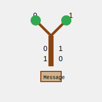

# Archived Message Reconstruction

## Overview
Welcome to my Archived Message Reconstruction project! This is a Java-based application I developed to decode compressed messages stored using a custom binary tree encoding. Through this project, I aimed to explore the practical applications of data structures, particularly binary trees, in encoding and decoding information efficiently. By utilizing a binary tree, this program encodes characters into binary strings and reconstructs messages from their compressed formats.

This project showcases my skills in working with advanced data structures, recursion, and file handling in Java. It also demonstrates my ability to design and implement algorithms that manipulate tree structures, which is an essential skill in fields like data compression, cryptography, and information retrieval.



## Table of Contents
- [Overview](#overview)
- [Features](#features)
- [Project Structure](#project-structure)
- [Class Details](#class-details)
  - [MsgTree Class](#msgtree-class)
    - [Fields](#fields)
    - [Constructors](#constructors)
    - [Methods](#methods)
  - [Main Class](#main-class)
    - [Key Functions](#key-functions)
- [Installation](#installation)
- [Usage](#usage)
- [Input Format](#input-format)
- [Example](#example)
- [Performance Considerations](#performance-considerations)
- [Advanced Topics](#advanced-topics)

## Features
- **Binary Tree Encoding**: I’ve utilized a binary tree structure where each leaf node represents a unique character, and the path from the root to each leaf node encodes the character into a binary string.
- **Message Decoding**: The program decodes messages compressed using the custom binary tree encoding and outputs the decoded text.
- **Character Code Mapping**: The program outputs the binary codes for each character in the encoding scheme, providing insight into how each character is represented.
- **Flexible Input Handling**: The application supports reading encoding schemes and compressed messages from a file, allowing for easy testing and extension.
- **Modular Design**: I designed the project with clear separation of concerns, making it easy to extend and maintain.

## Project Structure
The project consists of two primary Java classes, each responsible for distinct aspects of the program's functionality:

1. **Main.java**: This class manages the program’s execution, including file handling, initializing the binary tree, and displaying the output.
2. **MsgTree.java**: This class defines the `MsgTree` class, which represents the binary tree structure used for encoding and decoding messages.

## Class Details

### MsgTree Class
The `MsgTree` class is the core component of the application, encapsulating the logic for constructing and traversing the binary tree used in encoding and decoding operations.

#### Fields
- `char payloadChar`: This field represents the character stored at this node. If the node is an internal node (i.e., it has children), this field is set to `^` to indicate that it does not directly represent a character.
- `MsgTree left`: This field represents the left child of this node, corresponding to the `0` bit in the binary encoding. This field is `null` if the node has no left child.
- `MsgTree right`: This field represents the right child of this node, corresponding to the `1` bit in the binary encoding. This field is `null` if the node has no right child.
- `static int staticCharIdx`: This static index is used during the construction of the tree from the encoding string. It tracks the current position in the encoding string and is incremented as the tree is constructed.

#### Constructors
- **MsgTree(String encodingString)**: This constructor builds the entire binary tree from a single encoding string. The encoding string is a preorder traversal of the tree, where `^` indicates an internal node and any other character represents a leaf node. The constructor recursively processes the encoding string to build the tree.
- **MsgTree(char payloadChar)**: This constructor creates a single node tree with no children. It’s typically used to create leaf nodes that directly represent characters.

#### Methods
- **printCodes(MsgTree root, String code)**: This method recursively traverses the binary tree, starting from the given root node. For each leaf node encountered, it prints the character stored in that node and the binary code that corresponds to the path from the root to that node. This method provides a clear mapping between characters and their encoded binary strings.
- **decode(MsgTree codes, String msg)**: This method decodes a given compressed message using the binary tree. Starting from the root of the tree, it processes each bit of the message, traversing left for `0` and right for `1`. When a leaf node is reached, the corresponding character is added to the output, and the traversal restarts from the root for the next character in the message.

### Main Class
The `Main` class is the entry point of the application, responsible for orchestrating the execution of the program. It handles user input, initializes the binary tree, and manages the output of the program.

#### Key Functions
- **main(String[] args)**: The program's main entry point. It prompts the user for a filename, reads the encoding scheme and compressed message from the file, constructs the `MsgTree`, and then outputs the character codes and decoded message.
- **readFile(String filename)**: This method reads the contents of the specified file, which should contain the encoding scheme and the compressed message. It returns a string array where the first element is the encoding scheme and the second element is the compressed message.
- **printOutput(MsgTree tree, String compressedMessage)**: This method prints the binary codes for each character in the encoding scheme, followed by the decoded message.

## Installation
To set up the project on your local machine, follow these steps:

1. **Clone the repository**:
   ```bash
   git clone https://github.com/Abhay-2004/Archived-Message-Reconstruction.git
   ```
2. **Navigate to the project directory**:
   ```bash
   cd Archived-Message-Reconstruction
   ```
3. **Compile the Java files**:
   Make sure you have the Java Development Kit (JDK) installed on your system. Then, compile the Java files using the following command:
   ```bash
   javac Main.java MsgTree.java
   ```

## Usage
After compiling the project, you can run the program by executing the following command in the terminal:

```bash
java Main
```

### Input File
The program expects an input file that contains the encoding scheme and the compressed message. The file should be structured as follows:

- The first part of the file contains the encoding scheme, which is a preorder traversal of the binary tree used for encoding.
- The second part of the file contains the compressed message string.

### Example Run
1. Run the program:
   ```bash
   java Main
   ```
2. When prompted, enter the filename (e.g., `message.arch`).
3. The program will output:
   - The binary codes for each character in the encoding scheme.
   - The decoded message.

### Input Format
The input file should adhere to the following format:

- **Encoding Scheme**: A string representing a preorder traversal of the binary tree.
  - `^` indicates an internal node.
  - Any other character represents a leaf node containing that character.
- **Compressed Message**: A binary string representing the encoded message.

#### Example Input File (`example.arch`)
```
^a^^!^dc^rb
10110101011101101010100
```

### Example Output
Given the above input file, the program would output:

```
character code
-------------------------
 a  0
 !  10
 c  1011
 d  1010
 r  110
 b  111

MESSAGE:
cadbard!
```

## Performance Considerations
- **Time Complexity**: The tree construction process operates in O(n) time, where n is the length of the encoding string. The decoding process also operates in O(m) time, where m is the length of the compressed message.
- **Space Complexity**: The space complexity is determined by the size of the binary tree and the input strings. The binary tree requires O(n) space for n nodes, and the input strings require O(m + n) space in total.

## Advanced Topics
- **Non-Recursive Tree Construction**: An advanced feature I’m considering is implementing a non-recursive, iterative method for constructing the binary tree. This could potentially improve the performance and reduce the stack space used by the program.
- **Compression Analysis**: I could extend this project to analyze the compression efficiency by comparing the size of the original message with the size of the compressed message. Metrics like average bits per character and compression ratio could be computed to evaluate the effectiveness of the encoding scheme.
- **GUI Implementation**: To make the project more interactive, I’m considering implementing a graphical user interface (GUI) that allows users to input files, view the binary tree structure, and see the decoded message in real-time.
